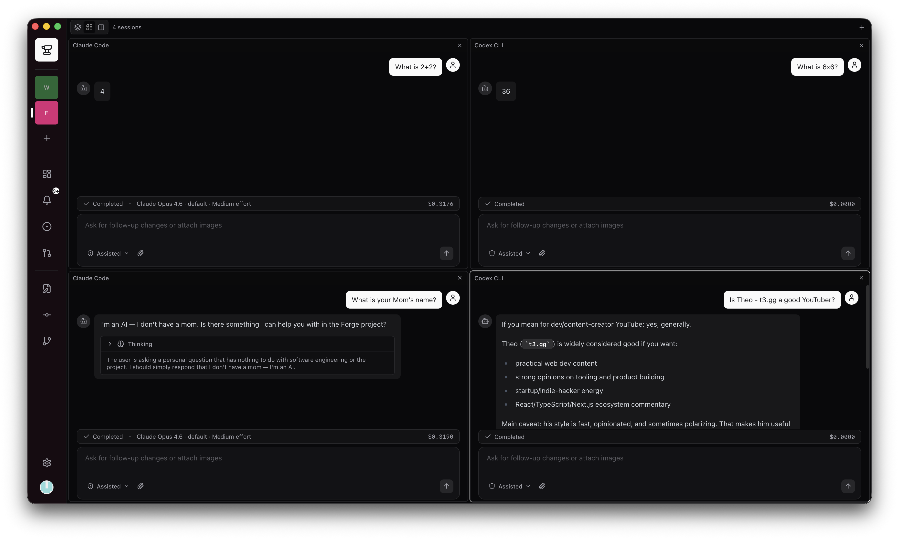
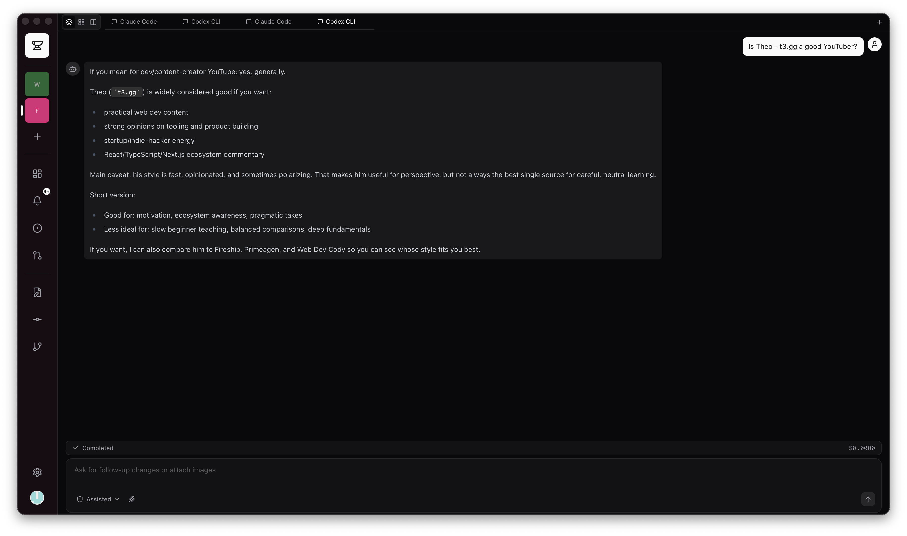
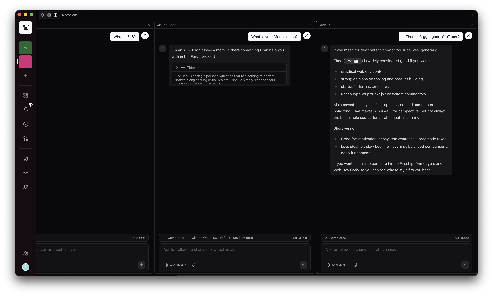
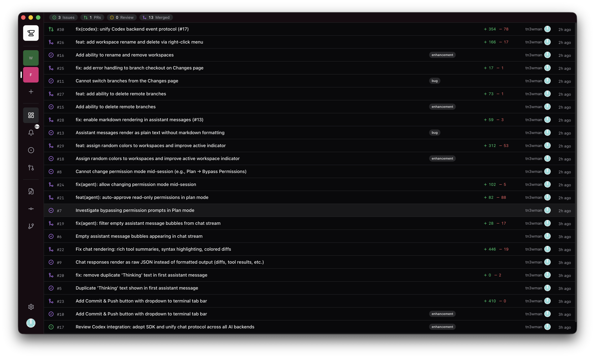
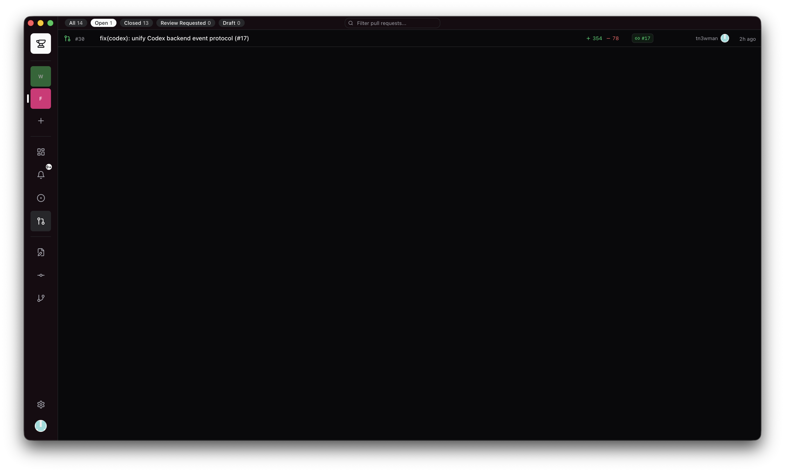
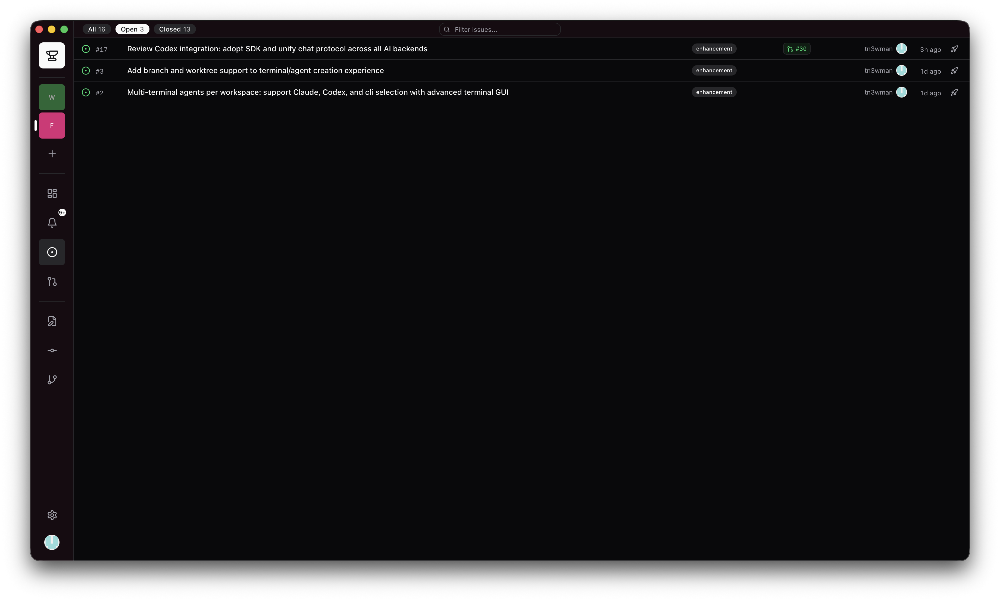
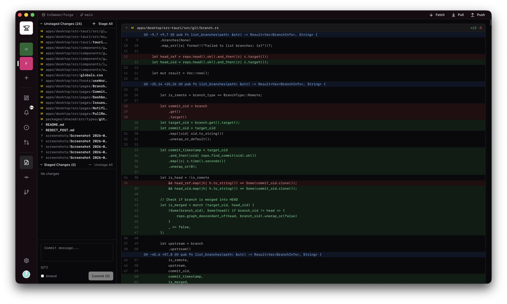
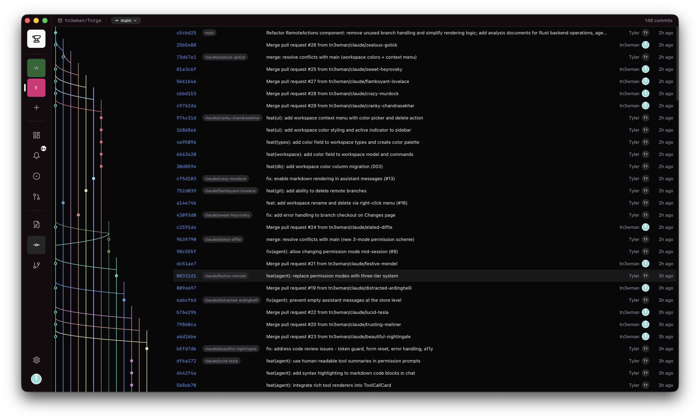
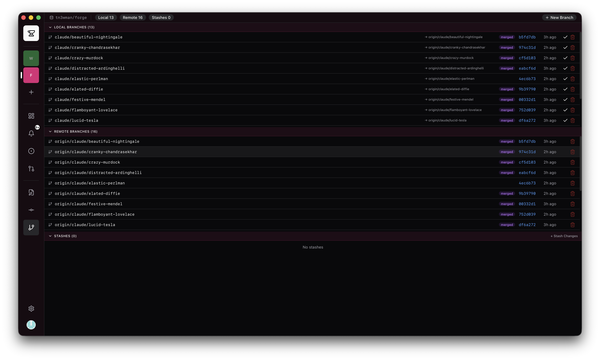

# Forge

An agentic development environment. Git client, GitHub dashboard, and AI agent workspace — in one native desktop app.

> **Disclaimer:** I'm not a programmer by trade. This entire app was vibe coded with AI agents — which is fitting, since it's an app *for* managing AI agents. If I did something architecturally horrifying, I'm sorry. If I accidentally violated a license, please just let me know nicely before sending a cease and desist. If I accidentally left any personally sensitive information in the code, please warn me and do not steal my identity. Lawyers, please don't come after me.

Forge exists because modern AI-assisted development means juggling three windows: the coding agent in a terminal, the PR in a browser, and an editor to actually see your files. Forge puts all of that in one place.



## The Problem

If you use Claude Code, Codex, Aider, or any coding agent, your workflow probably looks like this:

1. Run the agent in a terminal — it writes code, creates branches, opens PRs
2. Switch to a browser — review the PR, check CI, leave comments, merge
3. If there are issues, switch back to the terminal — tell the agent to fix them
4. Switch back to the browser — re-review, re-merge
5. Open VS Code — because you need to see what branch you're on, manage worktrees, look at a file

Multiply that by 3-4 concurrent agent sessions across different projects, and you're alt-tabbing dozens of times a day while trying to remember which worktree maps to which PR.

## The Solution

Forge is a single desktop app with three integrated surfaces:

**Git client** — Staging area, commit graph (canvas-based, handles 10K+ nodes at 60fps), branch management, stash operations, worktree management with automatic `node_modules` symlinking, fetch/pull/push.

**GitHub dashboard** — Pull requests, issues, reviews (approve/request changes/comment), merge (merge/squash/rebase), status checks, notifications. All via GraphQL for speed. Review a PR, approve it, and merge it without opening a browser.

**Agent workspace** — First-class Claude Code, Codex, and Aider integration. Not a chatbot sidebar — full PTY-backed sessions with tool call approval workflows, slash command autocomplete, image attachments, and plugin discovery. The agent runs in one panel while the PR it created appears in another.

## Screenshots

### AI Agent Sessions

Run multiple coding agents simultaneously. Tabs, 2x2 grid, or side-by-side columns — pick your layout.

| Tabs | Grid | Columns |
|------|------|---------|
|  |  |  |

### GitHub Integration

PRs, issues, and notifications — all without opening a browser.

| Dashboard (PRs + Issues) | Pull Requests | Issues |
|--------------------------|---------------|--------|
|  |  |  |


### Git Operations

Staging area with inline diffs, canvas-based commit graph, and full branch management.

| Changes + Diff Viewer | Commit Graph | Branches |
|-----------------------|--------------|----------|
|  |  |  |

## Features

### GitHub Integration

- **Device Flow OAuth** — Sign in with GitHub, no server required. Tokens stored in OS keychain (never in JS).
- **Pull Requests** — List, filter (open/closed/draft/review requested), review, merge (merge/squash/rebase), close, reopen. Full conversation timeline with inline comments.
- **Issues** — List, filter, comment, view timeline.
- **Code Review** — Diff viewer with CodeMirror 6 syntax highlighting. File tree with change indicators. Submit reviews with approve/request changes/comment.
- **Status Checks** — CI/CD status displayed on PR detail.
- **Notifications** — GitHub notification feed with read/unread management.
- **Dashboard** — Aggregated stats (open PRs, open issues, review requests, recently merged) with auto-refresh.
- **Search** — GitHub search API integration.

### Git Operations

- **Staging & Commits** — Stage/unstage files, write commit messages, amend previous commits.
- **Commit Graph** — Canvas-rendered commit history with lane topology, branch labels, and author avatars. Handles large repos without breaking a sweat.
- **Branches** — Create, checkout, delete, rename. Current branch display throughout the app.
- **Worktrees** — List, create, remove. When creating a worktree, Forge symlinks `node_modules`, `.next`, `dist`, `target`, and `.turbo` from the main tree so you skip redundant installs.
- **Stash** — Push, pop, apply, drop.
- **Remote** — Fetch, pull, push with automatic GitHub token authentication.
- **File Watching** — OS-level file system events (via `notify` crate) with debounce trigger automatic UI refresh when your repo changes.

### AI Agent Sessions

- **Multi-agent** — Claude Code, Codex, and Aider. Pluggable backend architecture for adding more.
- **Full PTY** — Agents run as real processes in native pseudo-terminals. Not fake terminals.
- **Permission Workflow** — When an agent wants to run a tool, you get a prompt. Press `y` or `n`. Three modes: normal (ask every time), plan (read-only auto-approve), yolo (`--dangerously-skip-permissions`).
- **Chat UI** — Message streaming, tool call cards with expandable input/output, reasoning display, image attachments.
- **Slash Commands** — Built-in commands plus auto-discovery from Claude Code plugins in `~/.claude/plugins/`.
- **Multi-session** — Run multiple agents in tabs, grid, or side-by-side column layout.

### Workspace Management

- **Multi-workspace** — Group repos by project. Switch between workspaces with `Cmd+1-9`.
- **Color-coded** — Each workspace gets a color tint applied to the UI so you always know where you are.
- **Persistent state** — Workspace configuration stored in local SQLite database.

### Keyboard-First

- `Cmd+K` — Command palette
- `G then D` — Dashboard
- `G then P` — Pull Requests
- `G then I` — Issues
- `G then N` — Notifications
- `G then H` — Changes (staging area)
- `G then C` — Commit Graph
- `G then B` — Branches
- `Cmd+1-9` — Switch workspace
- `Escape` — Back
- `Y / N` — Approve/deny agent permission prompts

## Architecture

```
┌─────────────────────────────────────────────────────────┐
│                    React 19 Frontend                     │
│  Zustand (state) · TanStack Query (cache) · Tailwind v4 │
├─────────────────────────────────────────────────────────┤
│                   Tauri 2 IPC Bridge                     │
├─────────────────────────────────────────────────────────┤
│                    Rust Backend                          │
│                                                          │
│  ┌──────────┐ ┌──────────┐ ┌──────────┐ ┌────────────┐ │
│  │  GitHub   │ │   Git    │ │  Agent   │ │  Terminal   │ │
│  │  GraphQL  │ │  git2-rs │ │  Claude  │ │  PTY       │ │
│  │  + REST   │ │          │ │  Codex   │ │  portable- │ │
│  │          │ │          │ │  Aider   │ │  pty       │ │
│  └────┬─────┘ └────┬─────┘ └────┬─────┘ └─────┬──────┘ │
│       │             │            │              │         │
│  ┌────┴─────────────┴────────────┴──────────────┴──────┐ │
│  │              SQLite (WAL mode)                       │ │
│  │    Workspaces · Repos · Users · Terminal Config      │ │
│  └─────────────────────────────────────────────────────┘ │
│                                                          │
│  ┌──────────────┐  ┌────────────────┐  ┌──────────────┐ │
│  │ OS Keychain   │  │ File Watcher   │  │ Repo Watcher │ │
│  │ (token store) │  │ (notify crate) │  │ (debounced)  │ │
│  └──────────────┘  └────────────────┘  └──────────────┘ │
└─────────────────────────────────────────────────────────┘
```

### Key Design Decisions

**Rust for everything sensitive.** GitHub tokens never touch JavaScript. Git operations use `git2` natively. Agent processes are spawned and managed from Rust.

**GraphQL-first GitHub API.** A single GraphQL query returns PR detail, reviews, timeline events, and status checks. REST is only used for notifications (GitHub doesn't support notification subscriptions via GraphQL).

**Canvas for the commit graph.** SVG chokes at ~1K nodes. Canvas handles 10K+ at 60fps with lane-based topology rendering.

**CodeMirror 6 for diffs.** 150KB bundle vs Monaco's 10MB. Modular, accessible, and fast.

**SQLite with WAL mode.** Local cache for GitHub data so the app feels instant. Foreign keys enforced. Schema migrations tracked.

**Worktree symlinks.** Creating a git worktree normally means running `npm install` again. Forge symlinks heavy directories (`node_modules`, `.next`, `dist`, `target`, `.turbo`) from the main worktree, saving minutes per worktree creation.

## Tech Stack

| Layer | Technology | Why |
|-------|-----------|-----|
| App framework | Tauri 2 | ~14MB bundle, native performance, Rust backend |
| Frontend | React 19 + TypeScript | Deepest ecosystem for this domain |
| Styling | Tailwind v4 + shadcn/ui | Zero-runtime CSS, full code ownership |
| Client state | Zustand 5 | 3KB, simple, persist middleware |
| Server state | TanStack Query v5 | Smart caching, 60s polling, background refetch |
| Git operations | git2-rs | Stable, full API for commits/branches/worktrees |
| GitHub API | GraphQL + REST | Batched queries, minimal round trips |
| Auth | GitHub Device Flow | No server needed, short-lived tokens |
| Token storage | OS keychain (`keyring`) | Keychain / Credential Manager / Secret Service |
| Database | SQLite (`rusqlite`, WAL) | Local cache, workspace state, preferences |
| File watching | `notify` crate | OS-level FS events with debounce |
| Diff viewer | CodeMirror 6 | 150KB, modular, syntax highlighting |
| Terminal | `portable-pty` + xterm.js | Real PTY, GPU-accelerated rendering (WebGL) |
| Icons | Lucide React | 1500+ icons, tree-shakeable |
| Command palette | cmdk | Powers Linear and Raycast |

## Project Structure

```
forge/
├── apps/
│   └── desktop/
│       ├── src/                    # React frontend
│       │   ├── components/         # UI components (60+)
│       │   │   ├── agent/          # Agent chat, permissions, tool cards
│       │   │   ├── git/            # Staging, commit graph, branches
│       │   │   ├── github/         # PR list items, merge button, status checks
│       │   │   ├── diff/           # CodeMirror diff viewer, file tree
│       │   │   ├── comment/        # Markdown editor, comment threads
│       │   │   ├── terminal/       # Terminal view, commit dialogs
│       │   │   ├── workspace/      # Workspace switcher, dialogs
│       │   │   ├── auth/           # Device flow, user menu
│       │   │   ├── layout/         # App shell, command palette
│       │   │   └── ui/             # shadcn/ui primitives
│       │   ├── pages/              # Route-level views
│       │   ├── hooks/              # Custom React hooks
│       │   ├── stores/             # Zustand stores
│       │   ├── queries/            # TanStack Query hooks
│       │   ├── ipc/                # Tauri command wrappers
│       │   └── lib/                # Utilities
│       │
│       └── src-tauri/
│           ├── src/                # Rust backend (6,300+ lines)
│           │   ├── commands/       # 60+ Tauri commands
│           │   │   ├── auth.rs     # Device Flow OAuth
│           │   │   ├── github.rs   # PRs, issues, reviews, merge
│           │   │   ├── git.rs      # Status, log, diff, branch, worktree
│           │   │   ├── agent.rs    # Agent session management
│           │   │   └── terminal.rs # PTY session management
│           │   ├── git/            # Git operations (git2)
│           │   ├── github/         # GraphQL queries + mutations
│           │   ├── agent/          # Agent backends (Claude, Codex)
│           │   ├── terminal/       # PTY + CLI discovery
│           │   ├── models/         # Data structures
│           │   ├── background/     # File watcher
│           │   ├── db.rs           # SQLite + migrations
│           │   └── keychain.rs     # OS keychain access
│           │
│           └── migrations/         # SQL schema migrations
│
├── packages/
│   ├── shared/                     # TypeScript types (IPC contracts)
│   ├── typescript-config/          # Shared tsconfig
│   └── eslint-config/              # Shared ESLint
│
├── Cargo.toml                      # Rust workspace root
├── turbo.json                      # Turborepo pipelines
└── pnpm-workspace.yaml             # pnpm workspace config
```

## Prerequisites

- **Node.js** >= 22
- **pnpm** >= 9
- **Rust** (latest stable, via [rustup](https://rustup.rs/))
- **Tauri 2 CLI** — installed via `cargo install tauri-cli` or as a dev dependency
- **Platform dependencies** — see [Tauri prerequisites](https://v2.tauri.app/start/prerequisites/) for your OS

## Getting Started

```bash
# Clone the repo
git clone https://github.com/tn3wman/forge.git
cd forge

# Install dependencies
pnpm install

# Start dev server (Vite + Tauri)
pnpm dev

# Production build
pnpm build
```

The dev server starts Vite on `localhost:1420` and launches the Tauri window. Hot reload works for the React frontend; Rust changes require a restart.

## Development

```bash
pnpm dev              # Start dev server
pnpm build            # Production build
pnpm test             # Run tests
pnpm lint             # Lint
pnpm format           # Format with Prettier
pnpm format:check     # Check formatting
```

### First Run

1. `pnpm dev` opens the app window
2. Sign in with GitHub via Device Flow (you'll get a code to enter at github.com/login/device)
3. Create a workspace and add repositories
4. Set local paths for repos you've cloned (Forge uses these for git operations)

## Status

Forge is in active development. It works on my machine. It might work on yours. No guarantees either way. If something breaks, that's expected — open an issue and I'll do my best.

## License

MIT
